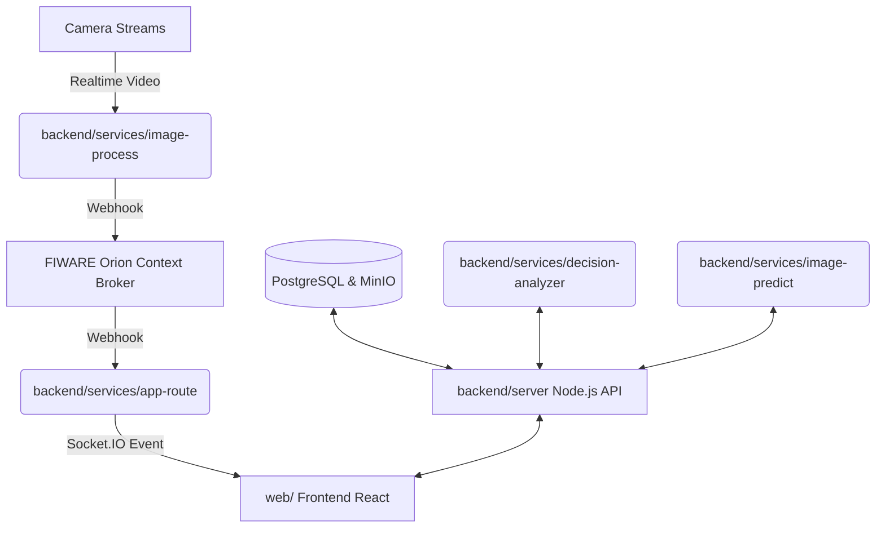

# 🎯 Mục tiêu dự án

## 🏗️ Kiến trúc tổng quan

Hệ thống được thiết kế theo mô hình **Microservices phân tán**, đảm bảo khả năng mở rộng mạnh mẽ và khả năng chịu tải tốt.



### Thành phần chính

#### Frontend (`web/`)
Xây dựng trên nền tảng **React + Vite** mang lại giao diện phản hồi nhanh và mượt mà.

#### Backend API (`backend/server/`)
Được triển khai bằng **Node.js + Express**, đảm nhận điều hướng, xử lý logic nghiệp vụ và xác thực dữ liệu.

#### Dịch vụ nền (`backend/services/`)
Các microservices viết bằng **Python** và **Node.js** chạy độc lập phục vụ xử lý chuyên sâu.

#### Realtime Hub (`app-route`)
Tiếp nhận thông tin qua Webhook trực tiếp từ FIWARE và phát tín hiệu tức thời đến Client thông qua Socket.IO.

#### Lưu trữ
Hệ thống lưu trữ tích hợp bao gồm:

- PostgreSQL (Dữ liệu quan hệ)
- MinIO (Đối tượng/Hình ảnh)
- FIWARE Orion Context Broker (Trạng thái thực tế)

#### Vận hành
Toàn bộ hệ thống được container hóa và điều phối bằng các tệp cấu hình Kubernetes (K8s) manifests trong thư mục `k8s-configs/`.

---

# 📂 Cấu trúc thư mục chính

```text
KLTN_2026/
├── backend/
│   ├── server/                 # Node.js API, middleware auth, routes, migrations
│   └── services/               # Các microservices Python/Node.js chạy nền
│       ├── app-route/          # Điều phối webhook từ FIWARE sang Socket.IO
│       ├── backup-postgres/    # Tự động sao lưu cơ sở dữ liệu
│       ├── data-export/        # Trích xuất dữ liệu lưu lượng
│       ├── decision-analyzer/  # Bộ phân tích và hỗ trợ ra quyết định
│       ├── image-predict/      # Mô hình học máy dự báo lưu lượng
│       ├── image-process/      # Xử lý hình ảnh/video từ luồng camera
│       ├── model-performance/  # Đánh giá hiệu suất mô hình dự đoán
│       ├── report-generator/   # Trình khởi tạo báo cáo tự động
│       ├── sync-actual/        # Đồng bộ dữ liệu thực tế để đối chiếu
│       └── shared/             # Thư viện dùng chung giữa các dịch vụ
├── web/                        # Mã nguồn ứng dụng Frontend (React + Vite)
├── schemas/                    # Tài liệu định nghĩa cấu trúc DB, FIWARE và MinIO
├── reports/                    # Tài liệu vận hành (AGENT_LOG, FUNCTION_LIST, DATA_FLOW, v.v.)
└── k8s-configs/                # Cấu hình Deployments, Services và Cronjobs trên Kubernetes
```

---

# ✨ Tính năng đã hoàn thiện

## 🔌 Hệ thống Backend API hiện tại

**Base URL mặc định (Local)**

```text
http://localhost:8080
```

### Các nhóm API Route chính

| Route | Chức năng |
|---------|---------|
| `/api/auth` | Xác thực người dùng, cấp phát và thu hồi token |
| `/api/cameras` | Quản lý danh sách, cấu hình và luồng dữ liệu camera |
| `/api/models` | Quản lý thông tin cấu hình các mô hình AI dự báo |
| `/api/model-metrics` | Truy xuất chỉ số đánh giá độ chính xác của mô hình |
| `/api/forecast` | Lấy dữ liệu dự báo lưu lượng theo các khung thời gian |
| `/api/traffic` | Truy xuất dữ liệu lưu lượng giao thông thực tế |
| `/api/data-library` | Quản lý tệp tin, nhập/xuất thư viện dữ liệu hệ thống |
| `/api/reports` | Tạo báo cáo tự động, lấy lịch sử báo cáo định kỳ |
| `/api/decisions` | Tiếp nhận và phân tích dữ liệu phục vụ bộ điều phối quyết định |
| `/api/help` | Cung cấp tài liệu hướng dẫn và thông tin trợ giúp hệ thống |

> ⚠️ **Lưu ý quan trọng**
>
> Tài liệu Swagger UI hiện tại đang được tạm đóng trong tệp `backend/server/src/index.ts` để chuẩn bị cho đợt nâng cấp giao diện và kiến trúc lớn tiếp theo (revamp).

---

# 💻 Hướng dẫn chạy hệ thống dưới Local

## 1. Backend Server (Node.js)

```bash
cd backend/server
npm install
npm run dev
```

Hệ thống server sẽ chạy mặc định ở cổng:

```text
8080
```

Các file cấu trúc và cập nhật cơ sở dữ liệu (Migrations) sẽ được gọi tự động thông qua hàm `runMigrations()` ngay khi server khởi chạy thành công.

---

## 2. Frontend Application (React)

```bash
cd web
npm install
npm run dev
```

Ứng dụng Frontend sẽ khởi chạy mặc định tại:

```text
http://localhost:5173
```

---

## 3. Khởi chạy Python Service mẫu (ví dụ: decision-analyzer)

```bash
# Di chuyển vào thư mục dịch vụ nền
cd backend/services/decision-analyzer

# Thiết lập môi trường ảo Python
python -m venv .venv

# Linux / macOS
source .venv/bin/activate

# Windows
.venv\Scripts\activate

# Cài đặt thư viện phụ thuộc
pip install -r requirements.txt

# Khởi chạy dịch vụ
cd app
python main.py
```

📚 Để biết cấu hình chi tiết hơn về microservice này, vui lòng tham khảo:

```text
backend/services/decision-analyzer/README.md
```

---

# 🛠️ Quy trình Build & Kiểm tra chất lượng (Quality Checks)

Trước khi đóng gói hoặc đẩy mã nguồn lên hệ thống quản lý, hãy chắc chắn chạy các lệnh kiểm tra sau để đảm bảo chất lượng.

## Backend

```bash
cd backend/server
npm run build
```

## Frontend

```bash
cd web
npm run build
npm run lint
```

---

# ☸️ Kiến trúc Kubernetes (K8s) & Tác vụ định kỳ (Cronjobs)

Hệ thống được thiết kế để tự động hóa tối đa quy trình vận hành trên môi trường Production bằng cụm Kubernetes.

### Tài liệu cấu hình

- Services (Manifests): `k8s-configs/services/`
- Cronjobs: `k8s-configs/cronjob/`

### Các tác vụ định kỳ hiện có

| Cronjob | Mục đích |
|----------|----------|
| backup | Định kỳ sao lưu dữ liệu PostgreSQL phòng chống sự cố |
| export | Tự động trích xuất các tập dữ liệu lưu lượng lớn phục vụ nghiên cứu |
| sync-actual | Đồng bộ hóa dữ liệu lưu lượng thực tế từ các điểm quan trắc |
| model-performance | Đánh giá sai số mô hình AI định kỳ và lưu snapshot hiệu năng |
| decision-analyzer | Phân tích nút thắt giao thông và chuẩn bị kịch bản phân luồng |

Ngoài ra còn có các tác vụ chuyên biệt phục vụ việc làm mới bộ nhớ đệm dữ liệu Materialized Views (MV).

---

# 📖 Tài liệu nguồn sự thật (Source of Truth)

Để nắm bắt chi tiết hơn về sơ đồ thiết kế và các đặc tả kỹ thuật nội bộ của dự án, vui lòng tham khảo:

| Tài liệu | Mô tả |
|-----------|--------|
| `reports/DATA_FLOW.md` | Kiến trúc và luồng dữ liệu chi tiết |
| `reports/report.md` | Báo cáo tổng quan chức năng |
| `reports/Functional Decomposition.md` | Phân rã chức năng hệ thống |
| `reports/FUNCTION_LIST.md` | Danh sách kiểm kê chức năng |
| `reports/AGENT_LOG.md` | Nhật ký hoạt động của hệ thống/Agent |

---

# 📢 Lưu ý cho bản phát hành (Release Notes)

Thông tin chi tiết về quá trình đóng gói bản phát hành đầu tiên được tổng hợp tại:

```text
reports/RELEASE_v1.0.0.md
```

> ⚠️ **Đặc biệt lưu ý**
>
> Toàn bộ thông tin cấu hình trong tệp `README.md` này đã được rà soát và căn chỉnh khớp chính xác với cấu trúc mã nguồn thực tế hiện tại.
>
> Tuyệt đối không sử dụng lại các giả định cũ lỗi thời (ví dụ: mặc định ứng dụng chạy ở cổng `3000` hoặc yêu cầu chạy thủ công script `npm run migrate`).