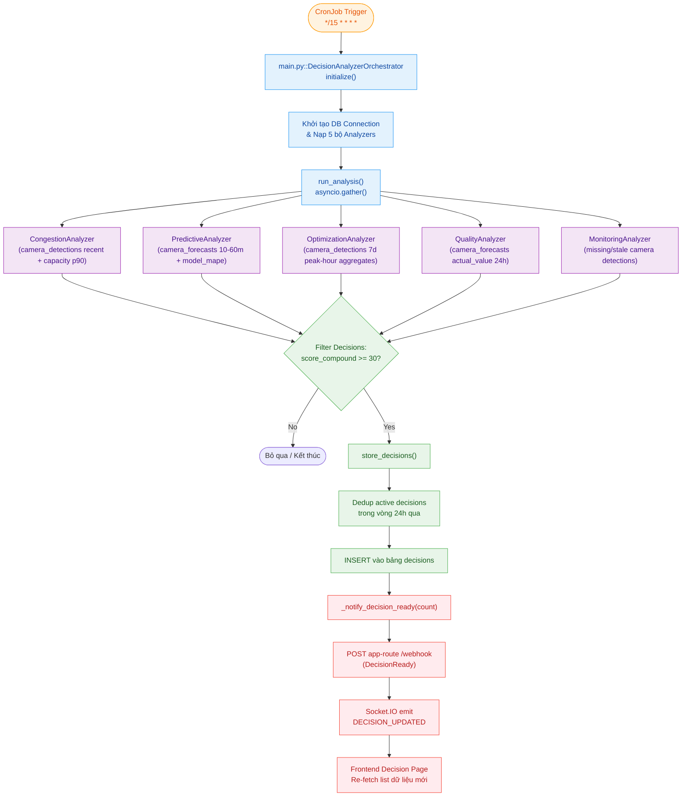
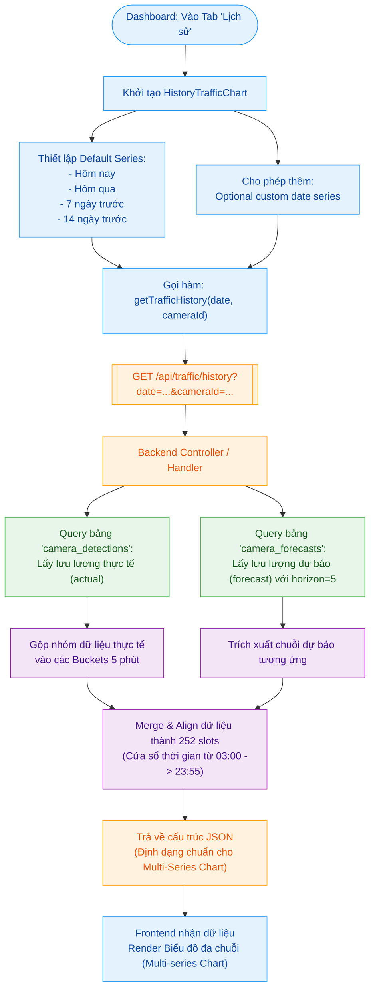

```mermaid
graph TD
    %% Định nghĩa các Style màu sắc
    classDef realTime fill:#f3e5f5,stroke:#9c27b0,color:#4a148c;
    classDef frontend fill:#e3f2fd,stroke:#2196f3,color:#0d47a1;
    classDef geoProcessing fill:#fff3e0,stroke:#ff9800,color:#e65100;
    classDef analytics fill:#fbe9e7,stroke:#ffab91,color:#bf360c;

    %% ========================================================================
    %% 1. DỮ LIỆU ĐẦU VÀO REALTIME
    %% ========================================================================
    SocketCtx([SocketContext Realtime])
    SocketCtx -->|"Emit: processedCameras"| MapPage["Traffic Map Page<br/>(traffic-map.tsx)"]

    %% ========================================================================
    %% 2. TƯƠNG TÁC NGƯỜI DÙNG (INPUT A-B)
    %% ========================================================================
    UserInteraction([User chọn Điểm đi A và Điểm đến B])
    UserInteraction -->|Methods: Text Input / GPS / Click Map| MapPage
    
    %% Kích hoạt Overlay tính toán
    MapPage --> Overlay["MapRouteOverlay<br/>(map-route-overlay.tsx)"]

    %% ========================================================================
    %% 3. XỬ LÝ KHÔNG GIAN & ĐỊNH TUYẾN (ROUTING PIPELINE)
    %% ========================================================================
    Overlay --> GeoRoute["Gọi geocode / fetchRoute"]
    GeoRoute --> GenRoutes["Tạo các tùy chọn tuyến đường:<br/>- Tuyến chính (Primary Route)<br/>- Tuyến thay thế (Alternative Route)"]

    %% Thuật toán gắn Camera vào Polyline tuyến đường
    GenRoutes --> FindCameras["findCamerasOnRoute()"]
    FindCameras --> MapCameraToRoute["Quét tọa độ & Gắn danh sách các Camera<br/>nằm dọc theo từng tuyến đường (Primary/Alt)"]

    %% ========================================================================
    %% 4. ĐÁNH GIÁ CẢNH BÁO (TRAFFIC ASSESSMENT)
    %% ========================================================================
    MapCameraToRoute --> MergeRealtime["Hợp nhất danh sách Camera trên tuyến<br/>với dữ liệu processedCameras realtime"]
    MergeRealtime --> EvalLOS["Đánh giá mức độ ùn tắc<br/>dựa trên chỉ số LOS (Level of Service) của Camera"]
    
    EvalLOS --> RenderOverlay["Render lên Map:<br/>1. Vẽ Polyline màu sắc theo tình trạng (Xanh/Vàng/Đỏ)<br/>2. Hiển thị Popup cảnh báo ùn tắc tại các nút giao"]

    %% ========================================================================
    %% 5. VÒNG LẶP ĐIỀU CHỈNH TỨC THỜI (RE-CALCULATION LOOP)
    %% ========================================================================
    RenderOverlay --> ReCalc{"User thay đổi<br/>vị trí A/B?"}
    ReCalc -- "Có" --> GeoRoute
    ReCalc -- "Không" --> KeepListening["Tiếp tục lắng nghe biến động LOS từ Socket"]
    KeepListening -.->|"Cập nhật màu tuyến realtime"| MergeRealtime

    %% Gán class cho các Node
    class SocketCtx,KeepListening realTime;
    class MapPage,UserInteraction,Overlay,RenderOverlay frontend;
    class GeoRoute,GenRoutes,FindCameras,MapCameraToRoute geoProcessing;
    class MergeRealtime,EvalLOS,ReCalc analytics;
```

# Luồng Dữ Liệu Hệ Thống (Data Flow)

> **Nguồn**: Đọc trực tiếp từ source code các service (04/2026)
> **Cập nhật**: 11/04/2026
> **Mục đích**: Mô tả đúng flow thực tế — dựa trên code, không phải tài liệu design cũ.

---

## Tổng quan các luồng

|  #   | Luồng                       | Trigger               | Tần suất thực tế                |
| :--: | :-------------------------- | :-------------------- | :------------------------------ |
| F-01 | Camera Detection            | Deployment loop       | 10s/camera, 20 camera song song |
| F-02 | Forecast Generation         | Scheduler nội bộ      | Mỗi phút chia hết cho 5 (UTC)   |
| F-03 | Sync Actual Values          | CronJob `3/5 * * * *` | :03, :08, :13, :18...           |
| F-04 | Model Performance           | CronJob `0 7 * * *`   | 07:00 UTC = 14:00 ICT           |
| F-05 | Model Training & Activation | Thủ công (Frontend)   | On-demand                       |
| F-06 | Data Export                 | CronJob `0 1 * * *`   | 01:00 UTC = 08:00 ICT           |
| F-07 | Report Generation           | On-demand (k8s Job)   | Khi user request                |
| F-08 | Database Backup             | CronJob `0 2 * * *`   | 02:00 UTC = 09:00 ICT           |
| F-09 | Frontend Access             | HTTP / WebSocket      | Realtime                        |
| F-10 | FIWARE Notification         | Push (subscription)   | Event-driven                    |

---

## F-01 — Camera Detection Flow

**Service**: `image-process` (Deployment — chạy liên tục)
**Source code**: `backend/services/image-process/app/main.py`

```
HCM City Traffic API (HTTPS snapshot)
  URL: https://giaothong.hochiminhcity.gov.vn:8007/Render/CameraHandler.ashx\?id\=\{cam_id\}
  └─► main() → asyncio.gather(*[camera_loop(cid, interval=10s) for cid in CAMERA_LIST])
        20 coroutines song song, mỗi loop đo thời gian xử lý thực rồi sleep phần còn lại

        fetch_camera()
          └─ aiohttp GET → image_bytes

        process_and_upload()   [ThreadPool executor — tránh block async loop]
          ├─ 1. cv2.imdecode(image_bytes)
          ├─ 2. model(frame) → YOLO results
          ├─ 3. detection_counts = {label: count, ...}
          ├─ 4. total_objects = sum(detection_counts.values())
          ├─ 5. results[0].plot() → annotated JPEG → cv2.imencode
          ├─ 6. s3_client.upload_fileobj() → MinIO
          │       key: "{cam_id}/{YYYYMMDD_HHmmss}.jpg"
          │       bucket: MINIO_BUCKET_NAME
          └─ 7. save_to_db()
                  INSERT camera_detections
                  (minio_key, camera_id, detections JSONB, total_objects, created_at UTC)

        update_fiware()
          ├─ capacity = capacity_map.get(cam_id, DEFAULT_CAPACITY)
          │     [capacity_map refresh mỗi 6h từ mv_forecast_capacity]
          ├─ status_current = calculate_los_status(total_objects, capacity)
          ├─ vc_ratio = round(total_objects / capacity, 4)
          └─ POST http://\{FIWARE_ORION_BASE\}/v2/entities\?options\=upsert
                headers: fiware-service: traffic_monitor, fiware-servicepath: /
                Entity type: Camera
                Fields: total_objects, detections, minio_key,
                        status.current (LOS), status.realtime (volume/capacity/vc_ratio/ts),
                        last_updated
                └─► FIWARE Orion → Subscription → POST app-route:5000/webhook
                      → Socket.IO emit CAMERA_UPDATED → Frontend Dashboard
```

**DB writes:**

| Bảng                | Columns                                                                       |
| :------------------ | :---------------------------------------------------------------------------- |
| `camera_detections` | `minio_key`, `camera_id`, `detections` (JSONB), `total_objects`, `created_at` |

---

## F-02 — Forecast Generation Flow

**Service**: `image-predict` (Deployment — scheduler nội bộ, không phải CronJob)
**Source code**: `backend/services/image-predict/app/predict_realtime.py`, `db_queries.py`

```
Pod khởi động:
  1. ensure_models_ready()
       ├─ Kiểm tra models/camera_rf_model_{5/10/15/30/60}m.joblib + encoder tồn tại
       ├─ Nếu thiếu: download từ MinIO theo is_active=TRUE từ bảng ml_models
       └─ Fallback: tải latest nếu chưa có bản is_active nào (deploy đầu tiên)
  2. threading.Thread → start_reload_server(port=8080)
       [HTTP server: POST /reload để hot-reload model không restart pod]
  3. load_models_into_cache()
       → _models_cache = {5m: RF, 10m: RF, 15m: RF, 30m: RF, 60m: RF}
       → _encoder_cache = LabelEncoder
  4. run_scheduler() — loop chính

Scheduler: calculate_next_run_time() → sleep đến phút chia hết cho 5 UTC
  run_cycle() [chạy tại :00, :05, :10, :15... UTC]
    │
    ├─ get_capacity_from_mv()
    │     → SELECT cam_id, capacity FROM mv_forecast_capacity
    │
    ├─ query_from_db_realtime()
    │     → camera_detections: 2h lookback
    │     → GROUP BY (cam_id, epoch/300*300 bucket)
    │     → Filter: total_objects > 5
    │     → Filter: time_bucket <= NOW() - 5min  [bucket đã hoàn thành]
    │     → LAG features: lag_5/10/15/30/60m
    │     → Trend features: trend_5m, trend_30m, trend_60m
    │     → ROW_NUMBER() OVER (cam_id ORDER BY time_bucket DESC) = 1
    │       → 1 dòng mới nhất/camera
    │
    ├─ predict_realtime(data)
    │     ├─ le.transform(camera_id) → integer encoding
    │     ├─ 5 RF models với feature set riêng biệt:
    │     │     5m & 10m: [cam_id, hour, min, dow, avg_obj, lag_5/10/15m, trend_5m]
    │     │     15m:      [cam_id, hour, min, dow, avg_obj, lag_10/15/30m, trend_5/30m]
    │     │     30m:      [cam_id, hour, min, dow, avg_obj, lag_15/30/60m, trend_30/60m]
    │     │     60m:      [cam_id, hour, min, dow, avg_obj, lag_30/60m, trend_30/60m]
    │     ├─ forecast_and_save_to_db(y_preds, df_valid)
    │     │     target_time = base_time + timedelta(minutes=5 + horizon)
    │     │     UPSERT camera_forecasts per (cam_id, forecast_for_time, horizon_minutes)
    │     └─ refresh_forecast_mv()
    │           → REFRESH CONCURRENTLY Materialized Views
    │
    └─ asyncio.gather(*tasks) — 20 cameras đồng thời:
          update_fiware(session, cam_id, total_objects, forecasts, capacity)
            ├─ status_forecast = calculate_los_status(forecasts["5m"], capacity)
            ├─ vc_ratio = forecasts["5m"] / capacity
            ├─ gti_info = calculate_trend_by_gti(current, capacity, forecasts)
            │     → direction (increasing/decreasing/stable)
            │     → gti_state (free_flow/normal/congestion_start/congestion_risk)
            │     → gti (%), current_ratio (%), diff (%)
            └─ POST /v2/entities?options=upsert [fiware-service: traffic_monitor]
                  Entity type: Camera (upsert prediction field)

          push_forecast_ready(session, camera_count=20)
            └─ POST /v2/entities?options=upsert
                  Entity: urn:ngsi-ld:ForecastReady:signal
                  Fields: triggered_at (DateTime UTC), cycle_cameras (Integer)
                  └─► FIWARE → app-route → Socket.IO emit FORECAST_UPDATED → Frontend
```

**DB writes:**

| Bảng               | Columns                                                                                                                                       |
| :----------------- | :-------------------------------------------------------------------------------------------------------------------------------------------- |
| `camera_forecasts` | `camera_id`, `forecast_for_time`, `horizon_minutes`, `predicted_value`, `input_value`, `input_sample_count`, `lag_sample_count`, `created_at` |

**Materialized Views được refresh ngay sau INSERT:**

| MV                         | Dùng cho API                 |
| :------------------------- | :--------------------------- |
| `mv_forecast_capacity`     | Capacity per-camera          |
| `mv_forecast_daily_stats`  | `GET /api/forecast/summary`  |
| `mv_forecast_hourly`       | `GET /api/forecast/timeline` |
| `mv_forecast_slots_recent` | `GET /api/forecast/rolling`  |

---

## F-03 — Sync Actual Values Flow

**Service**: `sync-actual` (CronJob `3/5 * * * *` → :03, :08, :13, :18...)
**Source code**: `backend/services/sync-actual/app/sync_actual.py`

> Chạy lệch ~3 phút sau F-02. Mục đích: điền actual_value để tính accuracy.

```
sync_actual_values()
  └─ Một câu UPDATE duy nhất:

     UPDATE camera_forecasts f
     SET actual_value    = sub.real_avg,     -- AVG(total_objects) của bucket đó
         sync_sample_count = sub.sample_count, -- COUNT(*) trong 5-min bucket
         error_value     = ABS(f.predicted_value - sub.real_avg)
     FROM (
         SELECT cam_id, time_bucket,
                AVG(total_objects) AS real_avg, COUNT(*) AS sample_count
         FROM camera_detections
         WHERE created_at >= NOW() - interval '5 hour'
         -- KHÔNG filter total_objects > 5 — actual phải phản ánh traffic thực tế
         GROUP BY cam_id, time_bucket
         WHERE time_bucket <= NOW() - interval '5 minutes'  [bucket đã hoàn thành]
     ) sub
     WHERE f.camera_id = sub.camera_id
       AND f.forecast_for_time = sub.time_bucket
       AND f.actual_value IS NULL
       AND f.forecast_for_time <= NOW() - interval '5 minutes'

  Kết quả: log rowcount đã sync, exit
```

**Không ghi FIWARE.** Chỉ đọc-ghi PostgreSQL.

---

## F-04 — Model Performance Evaluation Flow

**Service**: `model-performance` (CronJob `0 7 * * *` = 07:00 UTC = 14:00 ICT)
**Source code**: `backend/services/model-performance/app/main.py`, `analyze_metrics.py`, `update_fiware.py`

```
main() → run_single_update()
  │
  ├─ analyzer = ModelPerformanceAnalyzer(engine)
  ├─ report = analyzer.get_full_report(period_days=7)
  │     Queries: camera_forecasts WHERE actual_value IS NOT NULL (7 ngày gần nhất)
  │     Tính:
  │       overall:               MAE, MAPE, accuracy_5xe (% dự báo trong ±5xe)
  │       by_horizon (5/10/15/30/60m): MAE, MAPE, recommendation
  │       camera_ranking:        MAE, MAPE per camera (sort worst → best)
  │       data_coverage:         input_sample_count, lag_sample_count per horizon
  │       trend_accuracy:        accuracy theo peak/off-peak hours
  │       confidence_distribution: phân bố sai số theo bands (±5xe, ±10xe, ±20xe...)
  │
  ├─ save_metrics_history(metrics)
  │     INSERT model_metrics_history
  │       (snapshot_date DATE, generated_at, period_days, overall JSONB,
  │        by_horizon JSONB, camera_ranking JSONB, data_coverage JSONB,
  │        trend_accuracy JSONB, confidence_distribution JSONB)
  │     UNIQUE CONSTRAINT on snapshot_date → 1 row/ngày
  │
  └─ update_fiware(metrics)
        POST /v2/entities?options=upsert [fiware-service: traffic_monitor]
        Entity type: ModelMetrics
        └─► FIWARE → app-route → Socket.IO emit METRICS_UPDATED → Frontend Analytics
```

---

## F-05 — Model Training & Activation Flow

**Source code**: `backend/server/src/controllers/model.controller.ts`, `backend/services/image-predict/app/predict_realtime.py`, `reload_model.py`

### 5a. Training Job

```
Frontend → POST /api/models/train  {model_type, start_date, end_date}
  requireTechnician middleware
  └─► server (Node.js)
        ├─ k8s BatchV1 Job:
        │     image: image-predict container
        │     command: ["python", "train_single.py"]
        │     env: MODEL_TYPE, START_DATE, END_DATE + envFrom image-predict deployment
        │     resources: requests=2Gi, limits=4Gi RAM
        │     ttlSecondsAfterFinished: 3600
        └─ Return {job_name, job_id, status: "created"}

k8s Job → train_single.py:
  ├─ query_from_db_total(start_date, end_date)
  │     camera_detections với LAG + LEAD features (target_5/10/15/30/60m)
  │     Filter: total_objects > 5
  ├─ Feature engineering + RandomForest.fit() per horizon
  ├─ Evaluate: MAE, MAPE, R²
  ├─ joblib.dump() → local .joblib files
  ├─ Upload .joblib → MinIO bucket "ml-models"
  │     key: "{model_type}/{version}/{filename}.joblib"
  └─ INSERT ml_models
        (model_type, model_version, minio_key, mae, mape, r2, is_active=FALSE)
```

### 5b. Activation

```
Frontend → POST /api/models/:id/activate
  requireTechnician middleware
  └─► server (Node.js)
        ├─ DB Transaction:
        │     UPDATE ml_models SET is_active=FALSE WHERE model_type = (target type)
        │     UPDATE ml_models SET is_active=TRUE  WHERE id = :id
        ├─ apps.patchNamespacedDeployment() → k8s rollout restart image-predict
        │     [k8s_restart=false khi dev local — graceful fallback]
        └─ Return {success, message, k8s_restart}

Pod restart → ensure_models_ready():
  └─ Download model is_active=TRUE từ MinIO → disk
     load_models_into_cache() → _models_cache updated
```

### 5c. Hot Reload qua HTTP

```
POST http://image-predict-svc:8080/reload  {model_type: "random_forest_5m"}
  └─► ReloadHandler.do_POST()
        background thread:
          reload_active_model(model_type)
            → GET is_active=TRUE minio_key từ DB
            → MinIO download → disk overwrite
          refresh_cache_for_model_type(model_type)
            → joblib.load(file) → _models_cache[horizon] (thread-safe RLock)
        → Return 202 Accepted
```

---

## F-06 — Data Export Flow

**Service**: `data-export` (CronJob `0 1 * * *` = 01:00 UTC = 08:00 ICT)
**Source code**: `backend/services/data-export/app/main.py`, `query.py`, `exporter.py`

```
main()
  ├─ Tính D-1:
  │     yesterday = (now_utc - 1d).date()
  │     date_from = yesterday 00:00:00 UTC
  │     date_to   = date_from + 1d  (exclusive upper bound)
  │
  ├─ query_detections(engine, date_from, date_to) → DataFrame
  ├─ query_forecasts(engine, date_from, date_to)  → DataFrame
  │
  ├─ [Skip nếu cả hai DataFrame rỗng]
  │
  ├─ export_detections(df, yesterday, timestamp_str)
  │     → MinIO upload CSV
  │       key: "detections/YYYY/MM/DD/detections_{YYYYMMDD_HHmmss}.csv"
  │
  ├─ export_forecasts(df, yesterday, timestamp_str)
  │     → MinIO upload CSV
  │       key: "forecasts/YYYY/MM/DD/forecasts_{YYYYMMDD_HHmmss}.csv"
  │
  ├─ export_summary(yesterday, timestamp_str, det_df, fore_df, minio_keys)
  │     → MinIO upload JSON
  │       key: "summary/YYYY/MM/DD/summary_{YYYYMMDD_HHmmss}.json"
  │
  ├─ upsert_collection(engine, "Dữ liệu Phát hiện & Dự báo", "detections_forecasts")
  │     → INSERT OR UPDATE data_collections
  │
  └─ insert_entry(engine, collection_id, snapshot_date, minio_keys, file_sizes, record_count)
        → INSERT data_entries (metadata của snapshot)
```

---

## F-07 — Report Generation Flow

**Service**: `report-generator` (k8s Job — on-demand)
**Source code**: `backend/services/report-generator/app/main.py`

```
Frontend → POST /api/reports/generate {title, type, period_from, period_to, settings}
  └─► server (Node.js)
        ├─ INSERT reports (status='pending') → return report_id
        └─ Create k8s BatchV1 Job
               node: worker-node-01
               env: REPORT_ID (UUID), REPORT_CONFIG (JSON string)

k8s Job → generate_report(report_id, report_config):
  ├─ 1. _update_report_status(report_id, "generating")
  │
  ├─ 2. Data collection:
  │     num_days = period_to - period_from + 1
  │     if num_days > CHUNK_DAYS (default env=1):
  │         _generate_report_chunked()
  │           → chia thành từng ngày, query + analyze từng chunk, merge kết quả
  │     else:
  │         _collect_traffic_data(period_from, period_to, hour_from, hour_to)
  │           → query camera_detections + camera_forecasts trực tiếp
  │
  ├─ 3. analyze_traffic_data(traffic_data, cameras_data)
  │         → LOS breakdown (% từng mức free_flow/smooth/moderate/heavy/congested)
  │         → Forecast vs actual accuracy
  │         → Peak hours analysis
  │         → Anomaly detection
  │
  ├─ 4. create_executive_summary_pdf(analyzed_summary, report_meta)
  │         → PDF bytes (báo cáo tổng hợp cho quản lý)
  │
  ├─ 5. create_structured_data_xlsx(analyzed_summary, timeseries_data, report_meta)
  │         → XLSX bytes (dữ liệu chi tiết cho phân tích AI)
  │
  ├─ 6. _upload_files_to_minio(report_id, pdf_bytes, xlsx_bytes)
  │         → MinIO upload → {pdf: {key, size}, xlsx: {key, size}}
  │
  └─ 7. _update_report_status(report_id, "ready", {files, summary, generated_at})
            Frontend polling GET /api/reports/:id
            → khi status="ready" → download buttons hiển thị
```

---

## F-08 — Database Backup Flow

**Service**: `backup-postgres` (CronJob `0 2 * * *` = 02:00 UTC = 09:00 ICT)
**Source code**: `backend/services/backup-postgres/app/backup.py`

```
backup.py
  ├─ Kết nối PostgreSQL trực tiếp (psycopg2)
  │
  ├─ 1. log_backup_start(cursor)
  │       INSERT backup_logs (backup_type, started_at, status='running')
  │       → return backup_id
  │
  ├─ 2. run_pg_dump()
  │       cmd: pg_dump --host --port --username --dbname
  │                    --no-password
  │                    --format=custom   [binary format, nén tích hợp]
  │                    --compress=6      [level 6: cân bằng tốc độ/kích thước]
  │                    --file=/tmp/backups/postgres_backup_{ts}.dump
  │       PGOPTIONS:
  │         -c lock_timeout=30000        [fail nhanh nếu bị lock]
  │         -c statement_timeout=0       [không timeout COPY bảng lớn]
  │         -c tcp_keepalives_idle=10    [giữ TCP sống khi stream lớn]
  │
  ├─ 3. upload_to_gdrive()
  │       → subprocess: rclone copy {dump_file} {RCLONE_REMOTE}:{RCLONE_FOLDER}
  │         RCLONE_REMOTE default: "gdrive"
  │         RCLONE_FOLDER default: "School/KLTN_2026/In-project/Backups"
  │
  ├─ 4. cleanup_local_backup()
  │       → os.remove(/tmp/backups/postgres_backup_{ts}.dump)
  │
  └─ 5. log_backup_complete(cursor, backup_id, storage_location, file_size_mb, metadata)
          UPDATE backup_logs
          SET status='success'|'failed', completed_at, duration_seconds,
              storage_location, file_size_mb, compressed=TRUE, metadata JSONB
```

---

## F-09 — Frontend Access Flow

**Source code**: `web/src/`, `backend/server/src/`

```
Browser
  └─► Traefik (Reverse Proxy · Load Balancer · SSL Termination)
        ├─ Route /        → Nginx → web ui (React + Vite + Tailwind)
        ├─ Route /api/*   → server (Node.js REST API)
        └─ WebSocket      → app-route (Flask-SocketIO, port 5000)

Auth:
  ├─ Viewer (Guest):
  │     POST /api/auth/guest-token
  │     → JWT {role: "viewer", exp: 24h} — auto-gọi khi app mount
  │
  └─ Kỹ thuật viên:
        POST /api/auth/login {email, password}
        → bcrypt.compare() → access token (8h) + HttpOnly refreshToken cookie (30d)
        POST /api/auth/refresh → access token mới (8h) dùng refresh cookie
        POST /api/auth/logout  → xóa refreshToken cookie

WebSocket events từ app-route:
  ├─ CAMERA_UPDATED      → Dashboard: camera card realtime update
  ├─ FORECAST_UPDATED    → Dashboard Forecast chart re-fetch /api/forecast/rolling
  ├─ METRICS_UPDATED     → Analytics: model accuracy panel refresh
  ├─ TRAINING_JOB_UPDATED → Models page: training job status
  └─ MODEL_RELOAD_UPDATED → Models page: reload status
```

---

## F-10 — FIWARE Notification Flow

**Service**: `app-route` (Deployment — Flask + Socket.IO, port 5000)
**Source code**: `backend/services/app-route/app/main.py`

```
image-process / image-predict / model-performance
  └─► POST http://\{FIWARE_ORION_BASE\}/v2/entities\?options\=upsert
        headers: fiware-service: traffic_monitor, fiware-servicepath: /

        FIWARE Orion Context Broker (MongoDB backend)
          └─► FIWARE Subscription match (đã đăng ký trước)
                → POST http://app-route:5000/webhook  {data: [...entities]}

app-route fiware_webhook():
  parse payload['data'] → loop entities:
    ├─ type == 'Camera':
    │     socketio.emit('CAMERA_UPDATED', entity)
    ├─ type == 'ForecastReady':
    │     socketio.emit('FORECAST_UPDATED', {triggered_at, cycle_cameras})
    ├─ type == 'ModelMetrics':
    │     socketio.emit('METRICS_UPDATED', entity)
    ├─ type == 'TrainingJob':
    │     socketio.emit('TRAINING_JOB_UPDATED', entity)
    └─ type == 'ModelReload':
          socketio.emit('MODEL_RELOAD_UPDATED', entity)

  return 204
```

| Entity Type     | Ai tạo                                                 | Socket event           |
| :-------------- | :----------------------------------------------------- | :--------------------- |
| `Camera`        | image-process (detection) + image-predict (prediction) | `CAMERA_UPDATED`       |
| `ForecastReady` | image-predict (sau mỗi chu kỳ 5 phút)                  | `FORECAST_UPDATED`     |
| `ModelMetrics`  | model-performance (daily)                              | `METRICS_UPDATED`      |
| `TrainingJob`   | image-predict train.py                                 | `TRAINING_JOB_UPDATED` |
| `ModelReload`   | reload_model.py                                        | `MODEL_RELOAD_UPDATED` |

---

## Sơ đồ tổng hợp

```
  HCM City Gov API (HTTPS)
    └─ image-process (Deployment, 10s/cam)
          ├─► MinIO          "{cam_id}/{ts}.jpg"
          ├─► camera_detections (PostgreSQL)
          └─► FIWARE Camera  [observation: total_objects, LOS, vc_ratio]
                                  │ Subscription
                                  ▼
                            app-route:5000/webhook
                              └─► CAMERA_UPDATED ──► Frontend

  image-predict (Deployment, scheduler :00/:05/:10...)
    ├─ Reads: camera_detections (2h lookback)
    ├─ Reads: mv_forecast_capacity
    ├─ Writes: camera_forecasts (5 horizons UPSERT)
    ├─ Refreshes: mv_forecast_* (4 MVs)
    ├─► FIWARE Camera  [prediction: forecasts, GTI trend]  ──► CAMERA_UPDATED
    └─► FIWARE ForecastReady  ──► FORECAST_UPDATED ──► Frontend re-fetch

  sync-actual (CronJob :03/:08/:13...)
    ├─ Reads: camera_detections (5h lookback)
    └─ Updates: camera_forecasts.actual_value + error_value

  model-performance (CronJob 07:00 UTC daily)
    ├─ Reads: camera_forecasts (actual_value IS NOT NULL, 7 days)
    ├─ Writes: model_metrics_history (1/day, UNIQUE snapshot_date)
    └─► FIWARE ModelMetrics  ──► METRICS_UPDATED ──► Frontend

  data-export (CronJob 01:00 UTC daily)
    ├─ Reads: camera_detections + camera_forecasts (D-1)
    ├─► MinIO  detections/forecasts CSV + summary JSON
    └─► data_collections + data_entries (metadata)

  backup-postgres (CronJob 02:00 UTC daily)
    └─ pg_dump ──► rclone ──► Google Drive

  report-generator (k8s Job, on-demand)
    ├─ Reads: camera_detections + camera_forecasts
    ├─► MinIO  PDF + XLSX
    └─► UPDATE reports.status = 'ready'

  train-model (k8s Job, on-demand)
    ├─ Reads: camera_detections (historical)
    ├─► MinIO  .joblib model files
    └─► INSERT ml_models (is_active=FALSE)
          → Activate → image-predict reload cache

  Frontend (React)
    ├─ HTTP ──► Traefik ──► server (REST /api/*)
    └─ WS   ──► Traefik ──► app-route (Socket.IO)
```

---

## Ghi chú kỹ thuật

### K8s CronJob Schedules (từ k8s-configs/cronjob/\*.yaml)

| CronJob                        | Schedule (UTC) | ICT (UTC+7)           |
| :----------------------------- | :------------- | :-------------------- |
| `sync-actual`                  | `3/5 * * * *`  | :03, :08, :13, :18... |
| `forecast-mv-rolling-refresh`  | `*/4 * * * *`  | Mỗi 4 phút            |
| `traffic-mv-refresh`           | `0 * * * *`    | Mỗi giờ               |
| `minio-hourly-cleanup`         | `0 * * * *`    | Mỗi giờ               |
| `data-export`                  | `0 1 * * *`    | 08:00 ICT             |
| `backup-postgres`              | `0 2 * * *`    | 09:00 ICT             |
| `forecast-mv-capacity-refresh` | `0 2 * * *`    | 09:00 ICT             |
| `model-performance`            | `0 7 * * *`    | 14:00 ICT             |
| `scale-up-morning`             | `0 6 * * *`    | 13:00 ICT             |
| `scale-down-nightly`           | `0 0 * * *`    | 07:00 ICT             |
| `postgres-cleanup-job`         | `0 0 * * *`    | 07:00 ICT             |

> **image-predict** là Deployment với scheduler nội bộ — KHÔNG phải CronJob.

### Target Time Calculation (từ `db_queries.py::forecast_and_save_to_db`)

```python
# base_time = start của bucket input (ví dụ: 04:55:00)
target_time = base_time + timedelta(minutes=5 + horizon)
# horizon=5m  → 04:55 + 10min = 05:05
# horizon=60m → 04:55 + 65min = 06:00
```

### Features per Horizon (từ `predict_realtime.py::horizon_features`)

| Horizon  | Feature Set                                                              |
| :------- | :----------------------------------------------------------------------- |
| 5m & 10m | `camera_id, hour, minute, dow, avg_objects, lag_5/10/15m, trend_5m`      |
| 15m      | `camera_id, hour, minute, dow, avg_objects, lag_10/15/30m, trend_5/30m`  |
| 30m      | `camera_id, hour, minute, dow, avg_objects, lag_15/30/60m, trend_30/60m` |
| 60m      | `camera_id, hour, minute, dow, avg_objects, lag_30/60m, trend_30/60m`    |

### FIWARE Headers (thực tế từ tất cả code service)

```
POST http://\{FIWARE_ORION_BASE\}/v2/entities\?options\=upsert
fiware-service:    traffic_monitor
fiware-servicepath: /
```

### LOS Thresholds (từ `shared/los_utils.py`, dùng nhất quán toàn hệ thống)

| LOS         | V/C Ratio | Label        |
| :---------- | :-------- | :----------- |
| `free_flow` | < 60%     | Thông thoáng |
| `smooth`    | 60–75%    | Trôi chảy    |
| `moderate`  | 75–85%    | Vừa phải     |
| `heavy`     | 85–100%   | Đông đúc     |
| `congested` | ≥ 100%    | Ùn tắc       |

### Capacity Map Strategy

- Cả `image-process` và `image-predict` đều đọc từ `mv_forecast_capacity`
- **image-process**: cache 6 giờ trong `capacity_map` dict (module-level), refresh bằng `refresh_capacity_map_if_needed()`
- **image-predict**: đọc mới mỗi chu kỳ 5 phút qua `get_capacity_from_mv()`
- Fallback: `DEFAULT_CAPACITY` từ `shared/los_utils.py` nếu camera chưa có data

---

### F-11 — Decision-Making Flow

**Service**: `decision-analyzer` (CronJob `*/15 * * * *`)
**Source code**: `backend/services/decision-analyzer/app/main.py` + `app/analyzers/*.py`

```text
CronJob decision-analyzer
  └─► main.py::DecisionAnalyzerOrchestrator
    ├─ initialize() -> db connection + 5 analyzers
    ├─ run_analysis() -> asyncio.gather() all analyzers
    │     ├─ CongestionAnalyzer      (camera_detections recent + capacity p90)
    │     ├─ PredictiveAnalyzer      (camera_forecasts 10-60m + model_mape)
    │     ├─ OptimizationAnalyzer    (camera_detections 7d peak-hour aggregates)
    │     ├─ QualityAnalyzer         (camera_forecasts actual_value 24h)
    │     └─ MonitoringAnalyzer      (missing/stale camera detections)
    ├─ Filter decisions: score_compound >= 30
    ├─ store_decisions()
    │     ├─ dedup active decisions in last 24h
    │     └─ INSERT decisions table
    └─ _notify_decision_ready(count)
      └─ POST app-route /webhook (DecisionReady)
        └─ Socket.IO emit DECISION_UPDATED
          └─ Frontend Decision page re-fetch list
```



**DB writes:**

| Bảng        | Columns chính |
| :---------- | :------------ |
| `decisions` | `category`, `title`, `recommendation`, `rationale`, `score_*`, `camera_ids`, `evidence`, `action_items`, `status` |

### F-10b — FIWARE/App-route event bổ sung

| Entity Type      | Ai tạo             | Socket event         |
| :--------------- | :----------------- | :------------------- |
| `DecisionReady`  | decision-analyzer  | `DECISION_UPDATED`   |

### F-12 — Dashboard History Flow (Traffic History)

**Frontend consumer**: `web/src/components/dashboard/history/history-traffic-chart.tsx`
**Backend API**: `GET /api/traffic/history?date=YYYY-MM-DD&camera_id=all|<id>`
**Controller**: `backend/server/src/controllers/traffic-history.controller.ts`

```text
Dashboard tab "Lịch sử"
  └─► HistoryTrafficChart
        ├─ default series: hôm nay, hôm qua, 7 ngày trước, 14 ngày trước
        ├─ optional custom date series
        └─ gọi getTrafficHistory(date, cameraId)
              └─ GET /api/traffic/history
                    ├─ Query camera_detections -> actual (5-minute buckets)
                    ├─ Query camera_forecasts  -> forecast (horizon=5)
                    ├─ Merge thành 252 slots (03:00 -> 23:55)
                    └─ Trả data cho chart đa series
```


### F-13 — Traffic Map Route Decision Flow (Map)

**Frontend page**: `web/src/pages/traffic-map.tsx`
**Core overlay**: `web/src/components/traffic-map/map-route-overlay.tsx`

```text
Traffic Map page
  ├─ nhận processedCameras realtime từ SocketContext
  ├─ user nhập/chọn A-B (text, GPS, click map)
  ├─ MapRouteOverlay gọi geocode/fetchRoute
  ├─ findCamerasOnRoute() gắn camera theo tuyến primary/alt
  ├─ đánh giá cảnh báo ùn tắc theo LOS camera trên tuyến
  └─ cho phép cập nhật A/B và tính lại tuyến tức thời
```
